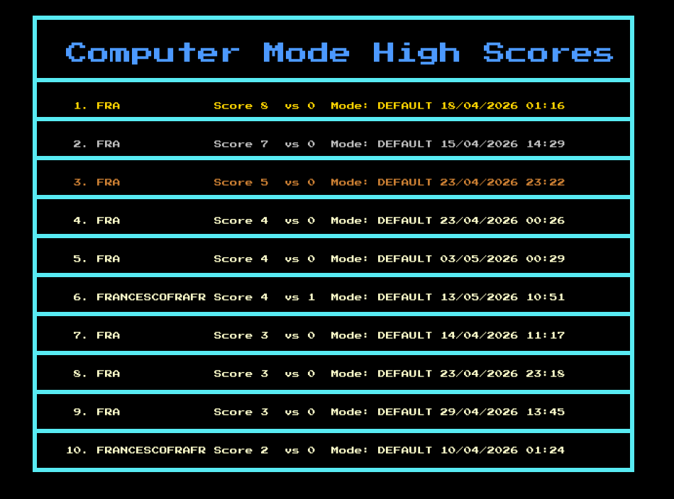
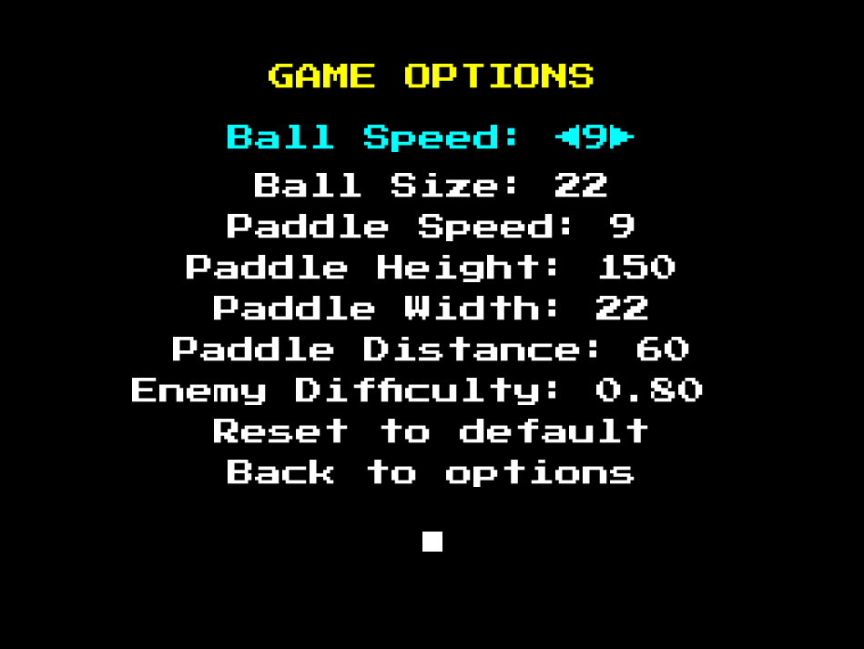

<h1>
    GoPong
    
</h1>


GoPong is a [Pong](https://en.wikipedia.org/wiki/Pong)-inspired game made in [Go](https://go.dev/) using the graphical library [Ebitengine](https://ebitengine.org/)


## Table Of Contents

- [Description](#description)
- [Gameplay](#gameplay)
- [Features](#features)
- [Controls](#controls)
- [Download & Installation](#download--installation)
- [Roadmap](#roadmap)
- [Contributing](#contributing)
- [Credits](#credits)
- [License](#license)

## Description

GoPong was made starting from [this youtube video](https://youtu.be/V_OGeYj6p00?si=IWM1MB7iM3R7jqLk) to start practicing with game programming, design and go development. The result is a modified version of Pong featuring Solo, Computer, and Multiplayer modes, along with high scores and various customization options, that was developed over the course of one year with approximately five months of active development

## Gameplay

There are currently three available game modes

<details>
<summary><strong>Solo Mode</strong></summary>

https://github.com/user-attachments/assets/4bfc5dc8-a7f0-48d0-a7db-3c338d4159ba

In Solo Mode you play against yourself with the ball bouncing on the wall. Every 5 points, the ball increases its speed
</details>

<details>
<summary><strong>Computer Mode</strong></summary>

https://github.com/user-attachments/assets/1de64e77-f6a2-4ff9-9b19-32accac5bd23

In Computer Mode you can play against the computer: you can choose between easy normal and hard difficulties, or manually adjusted in settings. The computer will try to catch your ball, and then return to the center of the game area to always try to be the nearest to the next impact point. The best way to beat the computer is by making shots with great angles as it is more difficult for it to predict them
</details>

<details>
<summary><strong>Multiplayer Mode</strong></summary>

https://github.com/user-attachments/assets/6c1e5973-7686-4386-a9aa-7a7f5cc6d37b

In Multiplayer mode two players can play against each other: the right player will play with the arrows and the left one with W S
</details>

## Features

### Highscores



GoPong features a highscores section: here it is possible to view the top 10 scores divided by Gamemode (and difficulty: in Computer highscores there are three different leaderboards for the three difficulties). You can move through the tables with Left/Right arrow and between the difficulties with Up/Down arrows (when in the Computer mode tab). Tables report data like time, player name, points and mode of the record

### Options



GoPong features many settings that can be adjusted to customize your game experience. The available settings are the following

**Game Options**

- Ball Speed
- Ball Size
- Paddle Height
- Paddle Width
- Paddle Distance: Distance of the paddle from the wall
- Enemy Difficulty: Difficulty of the computer in computer mode, where Easy = 0.2, Normal = 0.5, Hard = 0.8. You can customize your difficulty with every value between 0 and 1
- Reset to default: Sets all Game Options to default values

**Screen Options**

- Text Dimension: Dimension of Menu Text
- Screen Size: Various Screen dimensions, if not fullscreen
- Fullscreen: If set to true the game launches in fullscreen, else it launches in "Screen Size" option
- Reset to default : Sets all Screen Options to default values

## Controls

| Action | Key |
|---------|---------|
| Paddle Up | W/Up |
| Paddle Down | S/Down |
| Fullscreen/Window Mode | ESC |
| Confirm/Select/Pause | ENTER |

## Download & Installation

### 1) Installer

Installers are available for Windows and Debian-based distributions (.deb)

- [Download latest Windows Installer](https://github.com/IncredibleLego/GoPong/releases/latest/download/goPong_setup.exe)
- [Download latest Deb Installer](https://github.com/IncredibleLego/GoPong/releases/latest/download/goPong_amd64.deb)

Launch the installer on your Windows/Linux system to start the install process

### 2) Build from source

If your platform is different from Windows or Deb, or you simply want to compile the code from source, you will need to install
```bash
Requirements:
    go 1.25+
```

Once done so, you can clone the repository with

```bash
git clone https://github.com/IncredibleLego/GoPong.git
```

Once you enter the project folder, you can simply launch the game with

```bash
go run .
```

Go will download all the needed packages using the go.mod file. Alternatively, you can compile the project with

```bash
go build
```

And obtain a `goPong` executable that you can launch

## Roadmap

There are some known limitations and future plans for the game. In particular the mouse support is not very effective, it can be used in the main menus but not in the option menus. Some features that might be added in the future include

- [ ] Multiplayer online
- [ ] Change default buttons for controls
- [ ] Game Presets: ex. Fast Ball Small Paddle etc.
- [ ] Different color themes to choose from

## Contributing

Pull requests and issue reports are appreciated to make the game better

## Credits

- Inspired by Pong (Atari, 1972)
- Built with Go using Ebitengine
- Developed by Francesco Corrado/IncredibleLego
- Tested and influenced by friends and family suggestions
- Font used: [Press Start 2P](https://fonts.google.com/specimen/Press+Start+2P)
- Sounds used: Free Pong Sounds

## License

This project is open source and distributed under the MIT License. Feel free to use it for learning, modification or personal projects.   Full license text available in the [LICENSE](LICENSE) file.

© 2026 Francesco Corrado