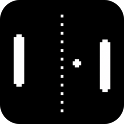
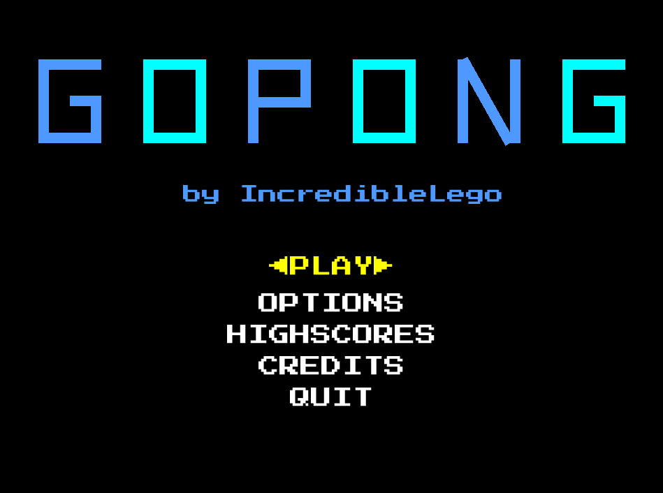

<h1>
    GoPong
    
</h1>

QUESTI SONO PHYSIGO sistma

GoPong is a [Pong](https://it.wikipedia.org/wiki/Pong) porting made in [Go](https://go.dev/) using the graphical library [Ebitengine](https://go.dev/)

# Description

GoPong was made starting from [this youtube video](https://youtu.be/V_OGeYj6p00?si=IWM1MB7iM3R7jqLk) to start practicing with game programming, design and go development. What came out is a modified Pong version that includes Solo, Computer and Multiplayer mode, hilights and various modification options

# Gameplay

There are currently three aviable gamemodes

<strong>Solo Mode</strong>

https://github.com/user-attachments/assets/4bfc5dc8-a7f0-48d0-a7db-3c338d4159ba

In Solo Mode you play against yourself with the ball bouncing on the wall. Every 5 points, the ball increases is speed

<strong>Computer Mode</strong>

https://github.com/user-attachments/assets/6c1e5973-7686-4386-a9aa-7a7f5cc6d37b

In Computer Mode you can play against the computer: you can choose between easy normal and hard difficulties. The difficulty can also be manually adjusted in settings: difficulty is a value between 0 and 1, where 0 is "you always score" and 1 is "scoring is extremely hard". The computer will try to catch your ball, and then return to the center of the game area to always try to be the nearest to the next impact point. The best way to beat the computer is by making shots with great angles as it is more difficult for it to predict them

<strong>Multiplayer Mode</strong>

https://github.com/user-attachments/assets/1de64e77-f6a2-4ff9-9b19-32accac5bd23

In Multiplayer mode two players can play against each other: the right player will play with the arrows and the left one with W S

## Download and Install

## Functionalities

## Controls

| Action | Button |
|---------|---------|
| Paddle Up | W/Up |
| Paddle Down | S/Down |
| Pause/Options | ESC |
| Confirm/Select | ENTER |

## Roadmap

- [x] Modalità IA
- [x] Multiplayer
- [ ] Multiplayer online
- [ ] Skin personalizzate
- [ ] Supporto gamepad

## Contributing

Pull requests and issue reports are appreciated to make the game better! 

## License

This project is open source and distributed under the MIT License. Feel free to use it for learning, modification or personal projects.  
Full license text aviabile in the [LICENSE](LICENSE) file.
